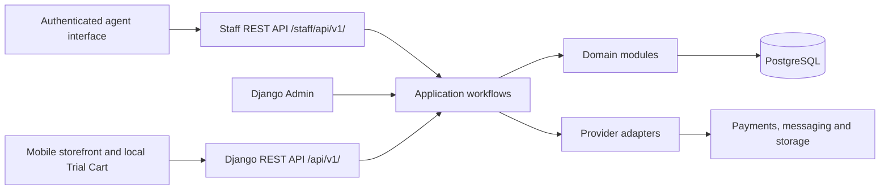

# Application architecture

Status: TASKS 1–3 RETAIN THEIR DELIVERED SCOPE; TASK 4 NOW COMPLETES CROSS-APP MODELS UNDER D-26. Retained storefront work moves to Task 5 and visual/UI design remains gated by D-21. Approved target architecture is not implemented behaviour or launch readiness. Updated: 2026-10-03.

The approved business principles are in [BUSINESS_CONTEXT.md](BUSINESS_CONTEXT.md) and [BUSINESS_RULES.md](BUSINESS_RULES.md). Decision statuses are authoritative in [DECISIONS.md](DECISIONS.md); BD-01/BD-02 are partially resolved by D-25 and BD-14 is resolved. Approved architecture does not answer remaining commercial, CA or legal questions; unsettled implementation detail stays reviewable.

## Starting shape

Use the approved Next.js / React frontend, Django with Django REST Framework backend, PostgreSQL database, and modular monolith. Begin the HTTP API at `/api/v1/`. The Task 1 baseline is Node.js 24 LTS, Next.js 16.3.5, React 19.3.0, TypeScript 6.0.3, Python 3.13, Django 5.2.17 LTS, DRF 3.18.1 and PostgreSQL 18. Live hosting is selected under [D-22](DECISIONS.md#d-22--aws-live-infrastructure-architecture-for-first-six-months): AWS managed services using CloudFront/WAF, Amplify Hosting for Next.js SSR, ECS Fargate for Django, private PostgreSQL, S3, Secrets Manager and CloudWatch.

The customer storefront and authenticated mobile staff interface may share a frontend repository, but the staff experience uses a dedicated host and `/staff/api/v1/` endpoints. The requested staff host is `staff.arkatara.com`; the public domain remains `arkatara.in`. Domain ownership/aliases, routing and credential topology require deployment verification rather than assuming these are sibling origins. Django Admin remains the back office, not the doorstep agent experience. Host separation does not replace authorization.

Frontend presentation follows the owner's [D-21 design gate](DECISIONS.md#d-21--frontend-visual-design-awaits-owner-input). Routes, contracts, server rendering, API integration boundaries, metadata/SEO, non-indexing controls, semantic accessibility and tests can be built independently of final visual design. Use only minimal unstyled or clearly temporary functional placeholders where necessary until the owner supplies the applicable approved UI, branding and screen references. Keep these foundations independent of provisional styling so that approved presentation can be added without changing business authority or domain contracts. This does not select a visual system or authorize polished customer/staff screens.

Keep business transactions within one backend and database. Module boundaries express ownership and permitted interactions; they do not imply microservices or separate databases. No Kubernetes, event-streaming platform or distributed transaction architecture is proposed for the pilot. The selected AWS deployment hosts the same modular monolith rather than changing the application architecture.

External adapters are introduced in the roadmap sequence. Payment and messaging production integrations are not part of Task 1. Safe development fakes support testing later domain work without sending real messages or collecting real money; they do not authorize a live collection method (BUSINESS DECISION BD-06). Provider selection, validation of shared QR/link capability, retry/fallback and retention settings remain BUSINESS DECISION BD-15; applicable privacy/messaging requirements remain LEGAL REVIEW LR-04. See [INTEGRATIONS.md](INTEGRATIONS.md).

## Module ownership and permitted dependencies

Task 4 owns persistence across these apps; the [coverage matrix](DATA_MODEL.md#task-4-model-coverage) must be complete before acceptance. Later tasks implement services/APIs/providers on those models. Reuse existing registered split model modules and framework tables; do not create a second source of truth or put business workflow orchestration into model signals merely to call it model work.

Implementation checkpoint, 2026-10-03: the [first identity/booking foundation](DATA_MODEL.md#implemented-task-4-identity-and-booking-foundation) now exists, with additive migrations and model/database tests. It retains StaffUser as AUTH_USER_MODEL and adds a separate non-authenticating CustomerAccount plus private draft booking/evidence and assignment tables. It does not yet complete the authentication contract, accepted-booking lifecycle or cross-app financial/operational schema. The ownership and workflow descriptions below remain the target architecture, not a claim that these services exist.

Proposed ownership follows. A reference to another module's record is not permission to mutate that record directly. Dependencies mean use of a narrow service or read contract, or an explicitly documented foreign key. Avoid business writes in model signals and generic save hooks: a reviewer should be able to see the workflow that makes the business commitment.

| Module | Owns | Allowed lower-level dependencies and limits |
| --- | --- | --- |
| `accounts` | StaffUser (AUTH_USER_MODEL) and separate CustomerAccount identity/authentication domains; staff permissions/profile/scope and customer authentication/recovery support | Reviewed framework/security primitives. No dependency on booking/financial workflows. Guest checkout never needs or creates CustomerAccount. |
| `compliance` | Legal entities, versioned configuration/policy, purpose-specific acceptance/consent and attributable audits | Explicit staff/customer/system actor context where appropriate, without passing CustomerAccount into a staff FK or linking guest bookings to accounts. It does not determine tax law or commercial policy. |
| `markets` | Markets, hubs, service areas, operating availability and serviceability queries | `compliance` for relevant legal-entity references if approved; no stock mutation. Inventory ownership is separate from operational hub location. |
| `catalog` | Materials, purities, categories, products, variants, media references and pricing inputs | Reference/configuration primitives; storage adapter interface for media. It does not calculate market availability by importing inventory writes. |
| `inventory` | Physical units, active commitments, custody, movements, condition and QC | Read references to `catalog`, `markets`, `accounts`, `compliance`. Booking IDs may be recorded as commitment context without calling trial workflows. |
| `trials` | Trial Plans, unified guest/account bookings and snapshots, boxes/items/allocations, booking phone verification and booking-specific guest access | Read/reference contracts for `catalog`, `markets`, `inventory`, `accounts`, `compliance`. No direct payment, delivery or invoice mutation; no guest-account claim path. |
| `delivery` | Assignment history, visit progress, Arrival OTP, dispatch manifest/document references and return handovers | Read/reference contracts for `trials`, `inventory`, `accounts`, `compliance`; inventory changes are coordinated through workflows. |
| `billing` | Purchase and purchase items, server-side sale calculations, tax configuration, invoices, correction-document references and numbering | Read/reference contracts for `catalog`, `trials`, `compliance`; verified payment evidence is supplied by a workflow rather than importing payment mutation code. |
| `payments` | Booking deposit records, payment contexts/attempts, verified gateway transactions, allocations, refunds and reconciliation | Read/reference contracts for `trials`, `billing`, `compliance`; provider adapters. It cannot rewrite prices, sale items, invoices or inventory. |
| `notifications` | Notification intent, templates and delivery outcomes | Provider interfaces and minimal supplied recipient/context data. No power to confirm booking, payment, refund or OTP verification. |
| `analytics` | Event ingestion, attribution and reporting projections | Read contracts/events from the other modules, with minimized personal data. Analytics failure must not determine business state. |
| Application workflows | Coordination of multi-module use cases, transaction boundaries, authorization and idempotency | May invoke the modules above; domain modules do not import this layer. It owns orchestration rather than a second copy of domain rules. |

This proposed dependency direction keeps the foundational reference modules independent, then builds inventory, trials, delivery/billing and payments above them. A catalogue availability endpoint composes catalogue and inventory read contracts in the API/application layer; it does not force an inventory-to-catalogue-to-inventory cycle. Notifications and analytics consume supplied events or projections rather than becoming workflow dependencies.

Cross-module foreign keys that would create migration cycles should be reviewed before migrations are written. For example, an inventory commitment can retain its own identifier and causal context while the trial allocation points to it. Do not resolve a cycle by dropping relational integrity silently or by allowing arbitrary writes across applications.

## Main workflows and authority

### Identity, authentication and rollout

Keep `accounts.StaffUser` as Django's sole AUTH_USER_MODEL for staff/Admin. CustomerAccount is a separate model with an explicitly separate principal/authentication contract. Use reviewed authentication components; two identity tables do not require two hand-written protocols. JWT versus session/cookie transport and providers remain implementation choices, not approved by the table split.

Staff APIs require a staff principal, action permission and assignment/market/hub scope. Customer APIs require a customer principal and ownership; `IsAuthenticated` alone is insufficient. Validate credential purpose/audience/type where applicable and prevent coincident IDs or client-supplied flags from crossing domains. Staff provisioning/MFA and customer signup/recovery have distinct lifecycles, including when the same person uses both systems.

Task 4 implements necessary identity/contact/auth persistence. Task 6 implements customer authentication and both checkout modes with customer signup/login/account checkout disabled server-side initially; Task 7 implements staff authentication/operations. Later customer activation requires explicit security/privacy/recovery readiness, not an automatic six-month timer. Recycled-number protection must cover registered login/recovery too: current phone possession alone cannot justify disclosing a previous holder's history.

Guest bookings remain permanently customer-unlinked, even when the phone matches an account or a signed-in customer chooses guest. Guest tracking uses scoped booking credentials; there is no claim/import or phone-history endpoint. Customer history queries use the immutable CustomerAccount FK, never contact matching. Store booking contact/address and policy facts independently of mutable customer profiles; account closure cannot erase or reassign financial history.

### Domain workflows

| Workflow | Required behavior and transaction boundary | Unresolved gates |
| --- | --- | --- |
| Browse and build Trial Cart | Render backend market/material/category configuration and availability. Store temporary customer intent locally. Reopening the browser may restore intent within a configured retention period; it never holds stock. | BUSINESS DECISION BD-03, BD-12, BD-13 for plan counting, Gold rules and initial configuration values. |
| Submit booking | Validate pending intent and immutable guest/account ownership; verify booking/phone/purpose-bound OTP and retain applicable terms/details before initiating upfront payment. Confirm only with trusted receipt and valid eligibility/stock acceptance. Use idempotency and atomic commitments under approved hold policy. | D-24/D-25; remaining BD-01, BD-02, BD-03, BD-04, BD-07, BD-08, BD-13. Missing amount/policy is not zero collection or automatic acceptance. |
| Reserve stock | Lock/recheck eligible units and competing commitments in one database transaction. Use a deterministic lock order. A committed reservation belongs to one booking's fulfillment context, not to an anonymous cart. | BUSINESS DECISION BD-02, BD-08, BD-09 for timing, hub sourcing and stock identification. |
| Prepare and dispatch | Preserve category boxes and one combined visit manifest. Record exact units, responsible staff, custody transfers and reviewed dispatch-document references. | BUSINESS DECISION BD-07, BD-08, BD-09; CA REVIEW CA-02; LEGAL REVIEW LR-01, LR-03. |
| Verify arrival | Confirm authorized assignment, current visit state and one valid hashed OTP challenge with expiry and attempt controls. Consume verification once and record it. Start the in-person trial only after backend verification. | BUSINESS DECISION BD-07 for exceptional revisits and BD-15 for resend/fallback settings. Numeric security limits await security design and relevant review. |
| Record customer selection | Validate that selected pieces belong to the attended trial and remain eligible. Backend computes a versioned purchase proposal and amount due from the approved pricing policy. Agent cannot override authoritative prices. | BUSINESS DECISION BD-04, BD-05 and CA REVIEW CA-01, CA-02. Selection is not automatically a completed sale. |
| Collect payment | Agent QR and customer URL address the same underlying active final PaymentAttempt through a common payment context. Verify gateway evidence server-side, deduplicate callbacks and record actual receipts even if a booking/attempt has expired. | BUSINESS DECISION BD-01, BD-02, BD-05, BD-06, BD-15; CA REVIEW CA-01, CA-02. A late receipt must not recreate a reservation or issue an automatic refund without an approved rule. |
| Confirm purchase and document sale | Coordinate verified funds/allocation, the agreed purchase version, unit disposition and historical sale snapshots idempotently. Issue the applicable immutable financial document under the reviewed timing and numbering rule. | BUSINESS DECISION BD-04, BD-05, BD-11; CA REVIEW CA-01, CA-02, CA-03; LEGAL REVIEW LR-02, LR-03. No zero-balance or delayed-payment handover default is selected. |
| Return and QC | Record each unpurchased unit leaving the visit, return custody, hub receipt and QC result. Only an authorized passing-QC workflow may restore availability. | BUSINESS DECISION BD-09. Purchased-item returns are a separate workflow gated by BD-10, CA-02 and LR-01. |

One TrialBooking normally represents one customer home visit, with multiple category-specific boxes fulfilled together from the selected city's operational inventory. It is not a collection of independent box checkouts. Proposed allocation and assignment history preserve future choices without enabling split visits or multi-hub sourcing before approval (BD-07, BD-08).

## Consistency and external effects

- Use database transactions for invariants that must hold together: incompatible stock commitments, reservation release, selected-unit disposition, verified receipt allocation, refund limits and invoice-number allocation. Validate inside the transaction, not only in a preceding API request.
- Use row locks and database constraints together where appropriate. A successful concurrency test must demonstrate that competing requests cannot promise the same unit incompatibly. A broad application-level availability check alone is insufficient.
- Store idempotency keys with operation scope, result and request fingerprint. Reusing a key with a different business request must not silently accept the new payload.
- Provider network calls must not be treated as part of an atomic database commit. Proposed persisted work items/outbox entries can record intended effects and support retries after commit without introducing an event-streaming platform. Required durable persistence is completed in Task 4; dispatch/retry behaviour is implemented with the owning workflow/provider task.
- Persist verified incoming callback identity and processing result. Retries and out-of-order events must not issue duplicate invoices, payments, stock movements, refunds or notifications. Treat an actual extra receipt as reconciliation evidence, not as an event to discard.
- Reservation expiry, payment verification, selection changes and cancellation must recheck the same relevant commitments under lock. No webhook may sell all trial contents simply because money arrived.
- Financial, custody, visit and notification states are separate. See [STATE_MACHINES.md](STATE_MACHINES.md). An invoice is not a payment receipt, a refund is not a stock return, and a failed notification is not a failed purchase.

## Configuration and history

Market codes and activation, hubs, service areas, materials, purities, categories, trial eligibility, box/item limits, Trial Plans, deposit rules, cart retention, reservation timeout and applicable tax configuration belong in managed data/configuration where reasonable. The approved initial Bengaluru/Silver scope can be seeded as data later; it must not become a hard-coded branch throughout the backend or frontend.

Use explicit policy versions or effective periods for rules whose historical effect matters. Booking commitments and purchase documents must retain the facts used at the time. A reference to a current Trial Plan or product is not a historical snapshot. Proposed configuration status includes an unconfigured/unapproved condition so an unanswered rule cannot fall back to an invented value. Suggested two boxes, seven-day cart retention and illustrative INR deposits remain BUSINESS DECISION BD-01/BD-13, not approved defaults.

Task 1 implements typed configuration contracts without default values, canonical exact-scope identity, and explicit errors for missing or conflicting approved revisions. Lookup checks approval evidence and timing before deciding whether approved revisions conflict; legacy records are never automatically approved. There is no scope precedence or latest-version fallback. Admin creates audited draft revisions only. Existing revision content cannot be edited through the model, queryset or Admin; this is an application-level guard, not a PostgreSQL trigger. An authorized activation/retirement/supersession workflow must be designed before any configuration drives live operations, including how to close an open-ended effective period without losing prior evidence.

LegalEntity Admin changes and configuration draft creation write AuditEvent evidence in the same database transaction. New staff attribution retains the staff UUID and protects referenced accounts from deletion. Audit model/queryset writes and a PostgreSQL trigger reject updates and deletes; privileged database owners can disable such controls, so deployed runtime roles must have restricted privileges. Legacy evidence is preserved as recorded rather than receiving invented attribution. Sale/document snapshot persistence is Task 4 scope; later workflows must populate and seal it at the approved boundary.

Gold must fit material/purity, pricing-mode and policy dimensions; Hyderabad must fit market/hub/service-area dimensions. Activation should require configuration, stock and operational readiness, not a migration solely for a new material or city. This does not mean all future offerings share Silver's policy or that legal, accounting and account prerequisites disappear. See BUSINESS DECISION BD-12 and the activation simulations in [TASKS.md](TASKS.md).

## Security, engineering and delivery discipline

- Use separate local, staging and production configuration, secrets, provider credentials and data. Deployment mechanics follow the AWS direction in D-22, but infrastructure provisioning, DNS, certificates, production secrets and launch cutover require explicit implementation and verification.
- Enforce staff authentication, action permissions and assignment/market/hub scope in the backend. Hiding a frontend button is not authorization. Explicit administrative workflows are required for price/configuration changes, assignments, refunds, corrections and manual reconciliation.
- Minimize guest customer data. Do not expose a booking merely because someone knows its sequential ID or phone number. Design guest access tokens, rate limits and staff access checks before exposing customer details. Customer terms, data access/retention/deletion and messaging consent remain LEGAL REVIEW LR-04; record relevant policy/version evidence without assuming service contact grants marketing consent.
- Hash OTP secrets; enforce purpose/booking/phone bindings, expiry, atomic single-use and attempt limits. Booking phone proof precedes upfront payment; Arrival OTP starts the trial; account login/recovery is another purpose. One arrival challenge serves WhatsApp and SMS, with no purchase-selection OTP. Never log plaintext codes or treat channel control as permanent identity/legal liability.
- Keep provider credentials and card-sensitive data out of application records and logs. Apply secure transport, session/cookie protection where relevant, CSRF protection for applicable authenticated requests, input validation and dependency review. Do not use real credentials in fixtures.
- Use formatting, linting, meaningful tests and CI, following the roadmap's main/development/feature-branch convention when source-control work is authorized. No branch or repository changes are performed by these documents.
- Review schema migrations before execution; separate schema changes, reviewed data backfills and business seeds. Preserve identifiers/history and plan safe rollout/rollback or forward recovery for data changes. Never reset production data to make a migration pass.
- Test invariant boundaries: stock races, assignment access, backend price authority, single QR/link collection, late/duplicate callbacks, deposit separation, immutable invoices, QC release and expansion configuration. Test policy-dependent outcomes only after the relevant decision is approved.
- Monitor API errors, payment/refund verification failures, stock inconsistencies, background-work failures and reconciliation mismatches. Backups and restoration need practical verification before launch.

Implemented entities and future proposals are distinguished in [DATA_MODEL.md](DATA_MODEL.md); review requirements are in [COMPLIANCE_AND_FINANCE.md](COMPLIANCE_AND_FINANCE.md); adapter boundaries are in [INTEGRATIONS.md](INTEGRATIONS.md). Task 4 continues with models-only scope under D-26, retaining D-20 search obligations; later domain behavior and provider setup still require corresponding scope approval and decision gates.

## Task 2 read contracts and policy boundary

`GET /api/v1/reference-data/` returns schema_version 1 and arrays of markets, materials, purities and categories, using public UUID, stable code, display name and ACTIVE/COMING_SOON status. Markets include country_code; purities include material_id. Draft/inactive references and purities whose material is hidden are omitted. No hubs, ownership, physical unit identities or prices are exposed.

`GET /api/v1/serviceability/?market=<code>&country_code=<country>&postal_code=<value>` returns the exact query identifiers, state CONFIGURED/UNCONFIGURED/COMING_SOON/INACTIVE/CONFLICT and bookable=false. CONFIGURED means only approved effective geographic coverage. Unknown/draft markets return 404, malformed/repeated parameters return 400, and writes return 405. These two reference endpoints are deliberately anonymous read-only surfaces; existing default API authentication remains in effect elsewhere.

The frontend's `catalog-contracts.ts` validates reference and serviceability JSON after the existing API transport. It also defines and validates future variant, availability and draft price representations. Decimal amounts stay strings; reference activation never derives bookability. The retained original Task 4 public projection, now owned by Task 5, is described below; the draft-price contract is not a customer-price endpoint.

Task 2 supplied validated catalogue/inventory identities; Task 3 adds the Admin/services described below. Pricing revisions remain immutable proposals, with PostgreSQL protection against UPDATE/DELETE. Snapshot values copy exact agreed facts rather than referencing mutable display fields. Transaction persistence and database immutability belong to Task 4; workflow binding remains Tasks 6–8; live calculations and tax rules remain gated.

## Task 3 back-office workflows

Reference Admin uses active staff/model permissions, draft-only creation, audited descriptive edits and a submitted revision token checked under a row lock. Stable identities, used variant definitions and stock history remain protected. Generic Admin cannot activate references or approve price/configuration revisions. Filters expose market, hub, material, category, status, physical availability and size without treating any filter as booking authority.

`inventory.services` owns registration, receiving and inspection. Each command reauthorizes its actor, fingerprints the request, acquires request/unit/reference locks and commits state, immutable movement and audit together. A successful exact retry returns the original result even if its procedure later expires; changed payload or current missing permission fails. Actual receipt and passing QC are separate facts. Hub-scoped approved procedure references gate operations; no business values or approval evidence are seeded.

`catalog.imports` is the bounded Admin onboarding application workflow: it composes catalogue validation with `inventory.services.register_unit` for physical drafts. It does not calculate availability or write operational status directly. Its outcome model is registered separately in `catalog.import_batches`, so model loading does not import workflow services. CSV apply validates every row again, locks request keys before variants/products, and commits all records/audits/outcome atomically. Preview is advisory; a later conflicting edit rejects the commit.

`catalog.media_services` owns private upload, metadata changes and authorized download. Storage references and credentials stay on the backend. The local/test adapter uses unique asset keys and exclusive file creation; an upload failure cleans up its own object. Filesystem/object storage and PostgreSQL are not one transaction: a process crash can leave an orphan, so a production adapter needs reviewed reconciliation/retention before deployment. Container/type validation is not a malware scan or full decoder. Only the versioned private metadata contract is shared with the frontend; publication/CDN/customer delivery are later work.

These paths implement D-19's bounded Task 3 scope. There is no reservation, dispatch, sale, customer-return, transfer, reinspection or retirement operation yet. Availability after approved QC is a physical fact; serviceability still returns `bookable: false`. Production media configuration and reviewed policy activation remain prerequisites, as recorded in TASKS.md.

## Task 4 public catalogue and search boundaries

This heading is retained for historical links. Under D-26, original 4.1–4.7 now execute in Task 5; current Task 4 owns model completion only. The following records retained technical work, not accepted visual design. Existing styling, composition and copy remain unapproved under D-21. Continue design-independent storefront work in Task 5; no prior technical evidence proves the new model checklist complete.

Retained original Task 4 work adds a public content projection without changing Product/Variant/physical Unit identity or the completed private onboarding boundary. `StorefrontPage` supplies one stable publication identity for a product, material or category. Django Admin authors drafts; separately permitted publish/withdraw actions record the actor and reason atomically. Published content must be withdrawn before editing. The immutable slug produces `/products/<slug>` or `/collections/<slug>` independently of mutable names, selected city and material filters. A page can be published only when its underlying reference is active; publication never approves price, stock, media delivery, eligibility or a booking. No real catalogue pages are seeded.

`GET /api/v1/catalogue/` and `GET /api/v1/catalogue/pages/<slug>/` are anonymous, read-only schema-version-1 contracts. They expose published page summaries, visible market/material options, pagination, public variant facts and a selected-market stock observation. Optional `market`, `material` and `page` inputs are bounded and cannot be repeated; invalid options return 400 and unknown/withdrawn pages return 404. A material collection defines its material context. A product detail is not a paginated list; when material is omitted, its context comes from that product's active variants rather than an unrelated global material default. Explicit selections remain explicit. The 12-item page size is a technical response bound, not a Trial Plan or inventory limit.

Availability requires ACTIVE catalogue references and an AVAILABLE unit with HUB custody at an ACTIVE hub in the selected ACTIVE market. The projection returns AVAILABLE_AT_HUB, UNAVAILABLE, COMING_SOON or UNCONFIGURED with `bookable: false` in every case. It reveals no unit IDs, hub identifiers, ownership, exact stock counts or private operational specifications. This is a physical-stock observation; it does not perform address serviceability, choose a fulfilling hub, reserve inventory or decide BD-08/BD-13. Existing serviceability reads remain separate and cannot themselves establish a booking.

Only reviewed public title/description, variant UUID/SKU, material/purity and size facts are projected. Arbitrary internal specification JSON is withheld. Private Task 3 media and draft PriceRevision rows are not serialized: prices return `state: UNCONFIGURED` and media currently returns an empty list. Frontend responsive-image support accepts only explicit public HTTPS origins and validated descriptive/dimension metadata, but no production media adapter or publication workflow is enabled. Public prices, tax wording and customer commitments remain gated by BD-04/BD-12/BD-15, CA-02 and applicable legal review.

The Next.js App Router renders the home page, collections, product details and how-it-works content on the server. `storefront-server.ts` makes fresh bounded API reads, validates the response contract and distinguishes missing content from a temporarily unavailable service. Collection/product service failures propagate to the Next.js server error boundary; they must not become a successful empty page or false 404. The home page retains useful static brand/how-it-works content and an outage panel, without adding noindex solely because its catalogue feed failed. Invalid query selections have a separate recovery state. Shared components provide semantic navigation, headings, breadcrumbs, data-driven selectors, coming-soon presentation and reserved image layout space. Trial-cart and booking actions remain later Task 5–6 work; a disabled CTA is not a completed booking path.

`seo.ts` centralizes the intended `https://arkatara.in` origin, page metadata, canonical URLs, Open Graph identity and escaped JSON-LD. Organization/WebSite data contains only known brand identity; Product/BreadcrumbList data uses visible published facts. No Offer, review, rating, physical address or legal identity is inferred. Filter/tracking variants are non-indexable and use the collection's public base canonical without a page number, so a filtered page cannot point to a nonexistent page in the default collection. Unfiltered collection pagination retains its own page number. Product canonical identity excludes query state. Breadcrumbs traverse only the relevant ancestor chain and omit hidden ancestors; they do not load all catalogue pages. `SITE_INDEXING_ENABLED` defaults to false; enabling it does not configure DNS or establish launch readiness. Immutable slugs currently prevent casual renaming; a reviewed alias/redirect mechanism must precede any later URL change.

These page features implement original 4.1–4.7 under D-20, now executed in Task 5 under D-26. Task 10 owns robots/sitemaps, deployment/HTTPS/preferred-domain and redirect verification, search-account setup and deployed performance/indexation evidence. Current implementation and verification status belong in [TASKS.md](TASKS.md); local markup or a successful build does not prove search indexing, Core Web Vitals or production readiness.

## Foundation delivery and local verification

The initial foundation PRs merged into `development`; follow-up PR #2 in each application subsequently merged into `main` with successful CI, verified on 2026-09-24. `development` is behind those main commits, so Task 2's `feature/task-2-domain-model` branches start from verified `origin/main`. Synchronize development through review before the next integration merge; no remote branch has been rewritten. Feature/fix branches receive CI through pull requests; pushes to main/development also run CI. See TASKS.md for exact evidence; Task 1 CI does not cover local Task 2 changes.

The backend README contains concrete PostgreSQL setup, settings selection, local test commands, migration review/application and recovery expectations. The frontend README describes separate build-time API configuration, predictable request failures and compatible artifact recovery. Runtime secrets, data and deployment settings must remain separate across environments. Staging/production reject missing backend database credentials and unrestricted/empty host configuration, and do not inherit local browser origins.

The API URL helper confines requests to the configured origin and versioned path. JSON requests distinguish HTTP, network, cancellation and invalid-response failures. Retained original Task 4 work extends the frontend placeholder with server-rendered public content and the limited stock observation above; it still makes no live booking promise.

On 2026-09-23, the owner resolved BD-14 by approving a documentation-only Git repository at `ARKA TARA/`, superseding the earlier deferral. It tracks `docs/`, root `AGENTS.md`, a repository README and Git setup files. Its explicit tracking list excludes both independent application repositories, local tools, databases, secrets and unlisted files. No application repository is merged into it or registered as a submodule.

The root [README](../README.md) documents how future developers obtain the published arkatara_docs repository and clone the backend/frontend beneath it. Their `../docs/` references remain valid without duplication. A standalone application clone or existing application CI checkout does not automatically contain the shared documents. Documentation changes use the main/development/feature review workflow; dependent application PRs should identify their companion documentation commit/PR. Task 2 was explicitly authorized after Task 1 verification.
