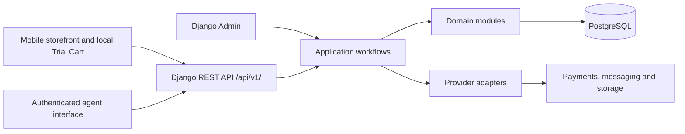

# Proposed architecture

Status: TASK 1 FOUNDATION AUTHORIZED 2026-09-19; later domain behavior remains for review.

The approved business principles are in [BUSINESS_CONTEXT.md](BUSINESS_CONTEXT.md) and [BUSINESS_RULES.md](BUSINESS_RULES.md). Open decisions, including all BD, CA and LR identifiers below, remain unresolved in [DECISIONS.md](DECISIONS.md). The architecture below is a proposal for meeting those principles, not an approval of unanswered commercial or review questions.

## Starting shape

Use the approved Next.js / React frontend, Django with Django REST Framework backend, PostgreSQL database, and modular monolith. Begin the HTTP API at `/api/v1/`. The Task 1 baseline is Node.js 24 LTS, Next.js 16.3.5, React 19.3.0, TypeScript 6.0.3, Python 3.13, Django 5.2.17 LTS, DRF 3.18.1 and PostgreSQL 18. Hosting remains unselected.

The customer storefront and authenticated mobile staff interface may share the frontend application, with separate routes, authorization requirements and data exposure. Django Admin is the initial back office for product onboarding, operations and authorized configuration. It is not the doorstep agent experience.

Keep business transactions within one backend and database. Module boundaries express ownership and permitted interactions; they do not imply microservices or separate databases. No Kubernetes, event-streaming platform, cloud deployment or distributed transaction architecture is proposed for the pilot.

External adapters are introduced in the roadmap sequence. Payment and messaging production integrations are not part of Task 1. Safe development fakes support testing later domain work without sending real messages or collecting real money; they do not authorize a live collection method (BUSINESS DECISION BD-06). Provider selection, validation of shared QR/link capability, retry/fallback and retention settings remain BUSINESS DECISION BD-15; applicable privacy/messaging requirements remain LEGAL REVIEW LR-04. See [INTEGRATIONS.md](INTEGRATIONS.md).

## Module ownership and permitted dependencies

Proposed ownership follows. A reference to another module's record is not permission to mutate that record directly. Dependencies mean use of a narrow service or read contract, or an explicitly documented foreign key. Avoid business writes in model signals and generic save hooks: a reviewer should be able to see the workflow that makes the business commitment.

| Module | Owns | Allowed lower-level dependencies and limits |
| --- | --- | --- |
| `accounts` | Staff identity, authentication, roles, permissions and optional delivery-agent profile | Framework/security primitives. No dependency on booking or financial workflow. Customer accounts are not required. |
| `compliance` | Legal-entity reference data, attributable audit evidence and references to reviewed policies/documents | Staff actor identifiers through `accounts`; generic subject identifiers avoid imports of every business module. It does not determine tax law or commercial policy. |
| `markets` | Markets, hubs, service areas, operating availability and serviceability queries | `compliance` for relevant legal-entity references if approved; no stock mutation. Inventory ownership is separate from operational hub location. |
| `catalog` | Materials, purities, categories, products, variants, media references and pricing inputs | Reference/configuration primitives; storage adapter interface for media. It does not calculate market availability by importing inventory writes. |
| `inventory` | Physical units, active commitments, custody, movements, condition and QC | Read references to `catalog`, `markets`, `accounts`, `compliance`. Booking IDs may be recorded as commitment context without calling trial workflows. |
| `trials` | Trial Plans, booking intent and commitment, category-specific boxes and selected contents | Read/reference contracts for `catalog`, `markets`, `inventory`, `accounts`, `compliance`. No direct payment, delivery or invoice mutation. |
| `delivery` | Assignment history, visit progress, Arrival OTP, dispatch manifest/document references and return handovers | Read/reference contracts for `trials`, `inventory`, `accounts`, `compliance`; inventory changes are coordinated through workflows. |
| `billing` | Purchase and purchase items, server-side sale calculations, tax configuration, invoices, correction-document references and numbering | Read/reference contracts for `catalog`, `trials`, `compliance`; verified payment evidence is supplied by a workflow rather than importing payment mutation code. |
| `payments` | Booking deposit records, payment contexts/attempts, verified gateway transactions, allocations, refunds and reconciliation | Read/reference contracts for `trials`, `billing`, `compliance`; provider adapters. It cannot rewrite prices, sale items, invoices or inventory. |
| `notifications` | Notification intent, templates and delivery outcomes | Provider interfaces and minimal supplied recipient/context data. No power to confirm booking, payment, refund or OTP verification. |
| `analytics` | Event ingestion, attribution and reporting projections | Read contracts/events from the other modules, with minimized personal data. Analytics failure must not determine business state. |
| Application workflows | Coordination of multi-module use cases, transaction boundaries, authorization and idempotency | May invoke the modules above; domain modules do not import this layer. It owns orchestration rather than a second copy of domain rules. |

This proposed dependency direction keeps the foundational reference modules independent, then builds inventory, trials, delivery/billing and payments above them. A catalogue availability endpoint composes catalogue and inventory read contracts in the API/application layer; it does not force an inventory-to-catalogue-to-inventory cycle. Notifications and analytics consume supplied events or projections rather than becoming workflow dependencies.

Cross-module foreign keys that would create migration cycles should be reviewed before migrations are written. For example, an inventory commitment can retain its own identifier and causal context while the trial allocation points to it. Do not resolve a cycle by dropping relational integrity silently or by allowing arbitrary writes across applications.

## Main workflows and authority

| Workflow | Required behavior and transaction boundary | Unresolved gates |
| --- | --- | --- |
| Browse and build Trial Cart | Render backend market/material/category configuration and availability. Store temporary customer intent locally. Reopening the browser may restore intent within a configured retention period; it never holds stock. | BUSINESS DECISION BD-03, BD-12, BD-13 for plan counting, Gold rules and initial configuration values. |
| Submit booking | Validate customer details, market/serviceability, active offerings, plan rules, categories, variant choices, availability and server-calculated values. Apply an idempotency key to safe retries. Commit any approved reservations atomically with booking facts. | BUSINESS DECISION BD-01, BD-02, BD-03, BD-04, BD-07, BD-08, BD-13. Missing policy is an explicit configuration/decision gap, not a zero deposit or automatic acceptance. |
| Reserve stock | Lock/recheck eligible units and competing commitments in one database transaction. Use a deterministic lock order. A committed reservation belongs to one booking's fulfillment context, not to an anonymous cart. | BUSINESS DECISION BD-02, BD-08, BD-09 for timing, hub sourcing and stock identification. |
| Prepare and dispatch | Preserve category boxes and one combined visit manifest. Record exact units, responsible staff, custody transfers and reviewed dispatch-document references. | BUSINESS DECISION BD-07, BD-08, BD-09; CA REVIEW CA-02; LEGAL REVIEW LR-01, LR-03. |
| Verify arrival | Confirm authorized assignment, current visit state and one valid hashed OTP challenge with expiry and attempt controls. Consume verification once and record it. Start the in-person trial only after backend verification. | BUSINESS DECISION BD-07 for exceptional revisits and BD-15 for resend/fallback settings. Numeric security limits await security design and relevant review. |
| Record customer selection | Validate that selected pieces belong to the attended trial and remain eligible. Backend computes a versioned purchase proposal and amount due from the approved pricing policy. Agent cannot override authoritative prices. | BUSINESS DECISION BD-04, BD-05 and CA REVIEW CA-01, CA-02. Selection is not automatically a completed sale. |
| Collect payment | Agent QR and customer URL address the same underlying active final PaymentAttempt through a common payment context. Verify gateway evidence server-side, deduplicate callbacks and record actual receipts even if a booking/attempt has expired. | BUSINESS DECISION BD-01, BD-02, BD-05, BD-06, BD-15; CA REVIEW CA-01, CA-02. A late receipt must not recreate a reservation or issue an automatic refund without an approved rule. |
| Confirm purchase and document sale | Coordinate verified funds/allocation, the agreed purchase version, unit disposition and historical sale snapshots idempotently. Issue the applicable immutable financial document under the reviewed timing and numbering rule. | BUSINESS DECISION BD-04, BD-05, BD-11; CA REVIEW CA-01, CA-02, CA-03; LEGAL REVIEW LR-02, LR-03. No zero-balance or delayed-payment handover default is selected. |
| Return and QC | Record each unpurchased unit leaving the visit, return custody, hub receipt and QC result. Only an authorized passing-QC workflow may restore availability. | BUSINESS DECISION BD-09. Purchased-item returns are a separate workflow gated by BD-10, CA-02 and LR-01. |

One TrialBooking normally represents one customer home visit, with multiple category-specific boxes fulfilled together from the selected city's operational inventory. It is not a collection of independent box checkouts. Proposed allocation and assignment history preserve future choices without enabling split visits or multi-hub sourcing before approval (BD-07, BD-08).

## Consistency and external effects

- Use database transactions for invariants that must hold together: incompatible stock commitments, reservation release, selected-unit disposition, verified receipt allocation, refund limits and invoice-number allocation. Validate inside the transaction, not only in a preceding API request.
- Use row locks and database constraints together where appropriate. A successful concurrency test must demonstrate that competing requests cannot promise the same unit incompatibly. A broad application-level availability check alone is insufficient.
- Store idempotency keys with operation scope, result and request fingerprint. Reusing a key with a different business request must not silently accept the new payload.
- Provider network calls must not be treated as part of an atomic database commit. Proposed persisted work items/outbox entries can record intended effects and support retries after commit without introducing an event-streaming platform. The implementation mechanism is to be selected during the relevant task.
- Persist verified incoming callback identity and processing result. Retries and out-of-order events must not issue duplicate invoices, payments, stock movements, refunds or notifications. Treat an actual extra receipt as reconciliation evidence, not as an event to discard.
- Reservation expiry, payment verification, selection changes and cancellation must recheck the same relevant commitments under lock. No webhook may sell all trial contents simply because money arrived.
- Financial, custody, visit and notification states are separate. See [STATE_MACHINES.md](STATE_MACHINES.md). An invoice is not a payment receipt, a refund is not a stock return, and a failed notification is not a failed purchase.

## Configuration and history

Market codes and activation, hubs, service areas, materials, purities, categories, trial eligibility, box/item limits, Trial Plans, deposit rules, cart retention, reservation timeout and applicable tax configuration belong in managed data/configuration where reasonable. The approved initial Bengaluru/Silver scope can be seeded as data later; it must not become a hard-coded branch throughout the backend or frontend.

Use explicit policy versions or effective periods for rules whose historical effect matters. Booking commitments and purchase documents must retain the facts used at the time. A reference to a current Trial Plan or product is not a historical snapshot. Proposed configuration status includes an unconfigured/unapproved condition so an unanswered rule cannot fall back to an invented value. Suggested two boxes, seven-day cart retention and illustrative INR deposits remain BUSINESS DECISION BD-01/BD-13, not approved defaults.

Task 1 implements typed configuration contracts without default values, canonical exact-scope identity, and explicit errors for missing or conflicting approved revisions. Lookup checks approval evidence and timing before deciding whether approved revisions conflict; legacy records are never automatically approved. There is no scope precedence or latest-version fallback. Admin creates audited draft revisions only. Existing revision content cannot be edited through the model, queryset or Admin; this is an application-level guard, not a PostgreSQL trigger. An authorized activation/retirement/supersession workflow must be designed before any configuration drives live operations, including how to close an open-ended effective period without losing prior evidence.

LegalEntity Admin changes and configuration draft creation write AuditEvent evidence in the same database transaction. New staff attribution retains the staff UUID and protects referenced accounts from deletion. Audit model/queryset writes and a PostgreSQL trigger reject updates and deletes; privileged database owners can disable such controls, so deployed runtime roles must have restricted privileges. Legacy evidence is preserved as recorded rather than receiving invented attribution. Actual sale/document snapshots remain the responsibility of the later transaction models.

Gold must fit material/purity, pricing-mode and policy dimensions; Hyderabad must fit market/hub/service-area dimensions. Activation should require configuration, stock and operational readiness, not a migration solely for a new material or city. This does not mean all future offerings share Silver's policy or that legal, accounting and account prerequisites disappear. See BUSINESS DECISION BD-12 and the activation simulations in [TASKS.md](TASKS.md).

## Security, engineering and delivery discipline

- Use separate local, staging and production configuration, secrets, provider credentials and data. Select deployment mechanics during authorized implementation; do not provision infrastructure from this document.
- Enforce staff authentication, action permissions and assignment/market/hub scope in the backend. Hiding a frontend button is not authorization. Explicit administrative workflows are required for price/configuration changes, assignments, refunds, corrections and manual reconciliation.
- Minimize guest customer data. Do not expose a booking merely because someone knows its sequential ID or phone number. Design guest access tokens, rate limits and staff access checks before exposing customer details. Customer terms, data access/retention/deletion and messaging consent remain LEGAL REVIEW LR-04; record relevant policy/version evidence without assuming service contact grants marketing consent.
- Hash OTP secrets; expire and limit challenges, audit verification outcomes and avoid logging plaintext OTPs. One arrival challenge may be sent through WhatsApp and SMS; channel delivery records do not create two codes.
- Keep provider credentials and card-sensitive data out of application records and logs. Apply secure transport, session/cookie protection where relevant, CSRF protection for applicable authenticated requests, input validation and dependency review. Do not use real credentials in fixtures.
- Use formatting, linting, meaningful tests and CI, following the roadmap's main/development/feature-branch convention when source-control work is authorized. No branch or repository changes are performed by these documents.
- Review schema migrations before execution; separate schema changes, reviewed data backfills and business seeds. Preserve identifiers/history and plan safe rollout/rollback or forward recovery for data changes. Never reset production data to make a migration pass.
- Test invariant boundaries: stock races, assignment access, backend price authority, single QR/link collection, late/duplicate callbacks, deposit separation, immutable invoices, QC release and expansion configuration. Test policy-dependent outcomes only after the relevant decision is approved.
- Monitor API errors, payment/refund verification failures, stock inconsistencies, background-work failures and reconciliation mismatches. Backups and restoration need practical verification before launch.

Detailed entity proposals are in [DATA_MODEL.md](DATA_MODEL.md); review requirements are in [COMPLIANCE_AND_FINANCE.md](COMPLIANCE_AND_FINANCE.md); adapter boundaries are in [INTEGRATIONS.md](INTEGRATIONS.md). Task 1 foundation code and migrations are authorized; later domain behavior and provider setup still require the corresponding scope approval and decision gates.

## Foundation delivery and local verification

The initial foundation PRs were merged into each repository's `development` branch with successful CI. Follow-up Task 1 verification fixes use `fix/task-1-verification`, based on the merged development commits. Feature/fix branches receive CI through pull requests; pushes to `main` and `development` also run CI. Promote reviewed changes to `main` only as a separate release action.

The backend README contains concrete PostgreSQL setup, settings selection, local test commands, migration review/application and recovery expectations. The frontend README describes separate build-time API configuration, predictable request failures and compatible artifact recovery. Runtime secrets, data and deployment settings must remain separate across environments. Staging/production reject missing backend database credentials and unrestricted/empty host configuration, and do not inherit local browser origins.

The API URL helper confines requests to the configured origin and versioned path. JSON requests distinguish HTTP, network, cancellation and invalid-response failures. The current frontend is a foundation placeholder with no live availability or booking promise.

On 2026-09-23, the owner resolved BD-14 by approving a documentation-only Git repository at `ARKA TARA/`, superseding the earlier deferral. It tracks `docs/`, root `AGENTS.md`, a repository README and Git setup files. Its explicit tracking list excludes both independent application repositories, local tools, databases, secrets and unlisted files. No application repository is merged into it or registered as a submodule.

The root [README](../README.md) documents how future developers obtain the shared repository and clone the backend/frontend beneath it. Their `../docs/` references remain valid without duplication. A standalone application clone or existing application CI checkout does not automatically contain the shared documents. Documentation changes use the main/development/feature review workflow; dependent application PRs should identify their companion documentation commit/PR. The documentation remote and publication remain a separate step. No Task 2 implementation is authorized yet.
